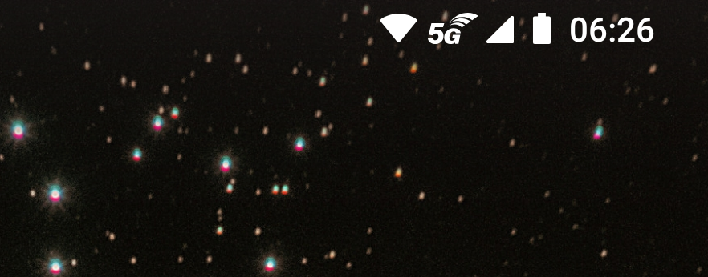
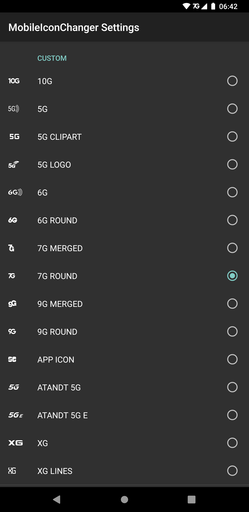

# MobileIconChanger
Change your mobile data icons! For example you can change the 3G/4G icons into 5G!

This module enables you to replace any of the mobile data icons with any other mobile data icon, from you system, other android versions and even a lot of custom ones.

Here's a list of icons selectable as replacements:
* All icons from `Android 11`
* All icons present on your system
* Some icons from `Android 4.2 (Jellybean)`
* All icons from `Android 5 (Lollipop)`
* All icons added in `Android 7 (Nougat)`
* [Custom icons](#screenshots) _(handcrafted SVG remakes or self drawn)_:
    * Several `5G` icons
    * The [official `5G` promotional logo](https://en.wikipedia.org/wiki/5G)
    * [`AT&T`'s variant of the `5G` icon](https://about.att.com/ecms/dam/pages/5G/5G_blue_logo_768x575_featured.jpg)
    * [`AT&T`'s variant of the fake `5Ge` icon](https://cdn.arstechnica.net/wp-content/uploads/2019/02/att-5ge-commercial-800x468.jpg)
    * Several `6G` icons
    * Several `7G` icons
    * Several `9G` icons
    * A `10G` icon
    * Several `XG` icons

## Inspiration
Well there sadly is a thing called "Wish.com".
On there a lot of phones called "`Samsung Galaxy S21 Ultra 5G`" get sold for 120 freedom eagles.
What one gets is totally useless (obviously),
but it's funny how the Android on these phones shows `5G`, 
although the hardware is only capable of `3G`.

Then there is `AT&T`. 
[Marketing is _obviously_ more important](https://www.engadget.com/2019-01-07-att-faux-5g-icon-rolls-out.html) 
than providing useful information, so they decided to 
[show a `5Ge` logo on phones connected over `4G+`/`LTE+`](https://www.engadget.com/2018-12-21-att-faux-5g-indicator.html).
[It even got included into `Android Open Source Project`](https://www.engadget.com/2019-04-26-att-5ge-android-open-source-project.html), 
so your phone probably has it to.

Well it all kinda became a meme so here we go.

There is also the Magisk module [Fake_5G_icon](https://github.com/E7KMbb/Fake_5G_icon), but I **do not** recommended using it, because live swapping stuff is a job for XPosed and not for Magisk.
Using this Magisk module has a much higher probability of breaking stuff in wrong ways and it may also prevent other mods from working properly.

## Compatibility

This mod should work on any AOSP-near ROM.

If your device has network activity indicators, it probably will not work.
Many ROMs use custom indicators, which are not supported as of now.

It has been developed and tested on `LineageOS 17.1` using `LSPosed`.

Requirements:
- `Android 8.1` (`SDK 27`) or higher
- An working XPosed framework 
  ([`EdXposed`](https://github.com/ElderDrivers/EdXposed)/[`LSPosed`](https://github.com/LSPosed/LSPosed))
  with API level `93` or higher

## Downloads

You can currently download the module from the
[LSPosed Repository](https://github.com/Xposed-Modules-Repo/com.programminghoch10.mobileiconchanger),
[XPosed Repository](https://repo.xposed.info/module/com.programminghoch10.mobileiconchanger)
or from the project's 
[GitHub Releases](https://github.com/programminghoch10/MobileIconChanger/releases).

## Installation

1. Install the module on a system which furfills the [module requirements](#compatibility).
1. **Activate the resource hooks** within your XPosed framework manager.
1. Activate the module. The package `SystemUI` should automatically be selected.
1. Restart your phone.  
   _This is necessary as the module will scan for icons to replace when `SystemUI` initializes._  
   _If you need to do it without restart: Open the configuration screen, click on `Restart SystemUI`, then force-close the module from the app settings before opening the configuration screen again._ 
1. You are now ready to use the module. You will need to open the [Configuration](#configuration) screen to set it all up, as the module won't do anything yet.

## Configuration

_I don't like it when every XPosed module adds yet another app icon to the launcher. This is why this modules settings are hidden within the App-Info screen._

Here is how to open the settings:

- Route 1:
    - Go to the module list within your XPosed manager
    - Long press on `CameraControl` and select App Info
    - On the bottom, click on `Advanced`
    - Click on `Additional settings in the app`
- Route 2:
    - Go into device settings
    - Click on apps
    - Somehow tell the device to show all apps
    - Select `CameraControl`
    - On the bottom, click on `Advanced`
    - Click on `Additional settings in the app`
- Route 3:
    - Open up an ADB shell
    - Run command `am start-activity com.programminghoch10.mobileiconchanger/.SettingsActivity`

### Additional notes:

The icons listed are all the icons your system has for showing a mobile data connection. 
Just because the system has them, does not mean it uses them. 
For example your system may have a `5G` icon, 
but the phone is not capable of operating on `5G` networks due to missing hardware. 
The system will then _(obviously)_ never use the `5G` icon and replacing it is useless.
You will need to look yourself, which of the icons are used.

Since this module hard-relinks the icon resources, a `SystemUI` restart is necessary to apply changes. 
Conveniently there is a button for that right at the bottom. 
You will need to give the app root access for this operation.

All icons from the Android Open Source Project contain a license notice within their icon file.
All custom icons included in this module are **selfmade** SVG remakes and are **NOT** direct copies. 
Just had a feeling I might have to say that.

## Screenshots

## Thank me

You want to thank me for my work?

Currently I don't take donations, 
but I hate them "`You will have to pay a small fee for all features`" modules anyways.

Just thank me by starring the 
[GitHub Repo](https://github.com/programminghoch10/MobileIconChanger) or 
[thanking me on XDA](https://forum.xda-developers.com/t/mod-xposed-8-1-mobileiconchanger-fake5gicon.4296313/) 
and telling your friends.

Have a great day!
